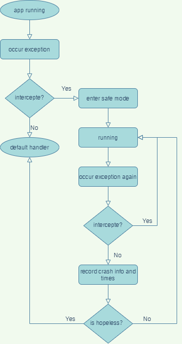

# Bandage

Bandage: 绷带

[Bandage仓库地址](https://github.com/porum/Bandage)

Bandage : 一个轻量级的处理线上Crash的Android库，它可以帮助你避免线上Crash问题。
> 它可以帮助你快速定位和解决线上问题。并进行兜底，避免线上Crash

----

## 思考

1. Android中有几种收集Activity的方式？
   1.  1. 利用Application.ActivityLifecycleCallbacks （参考：ActivityManager）